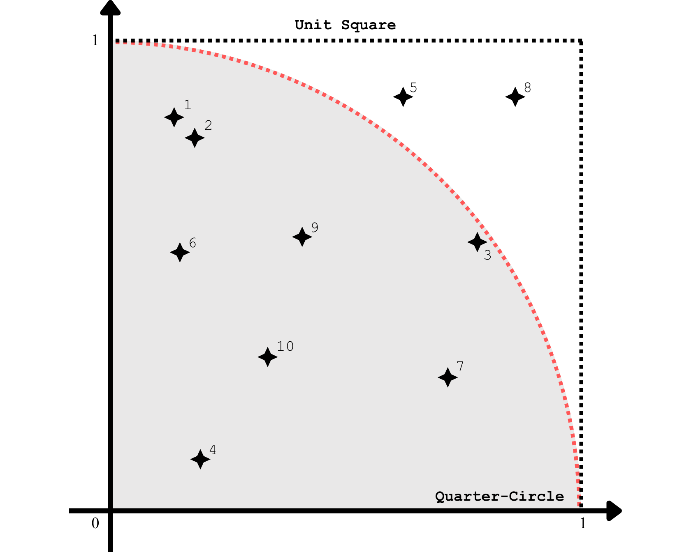
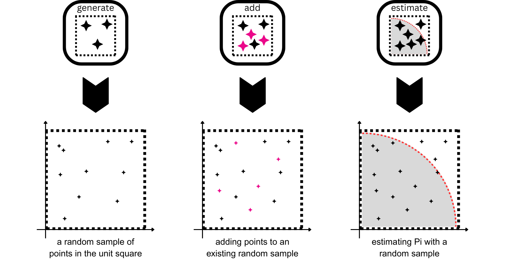
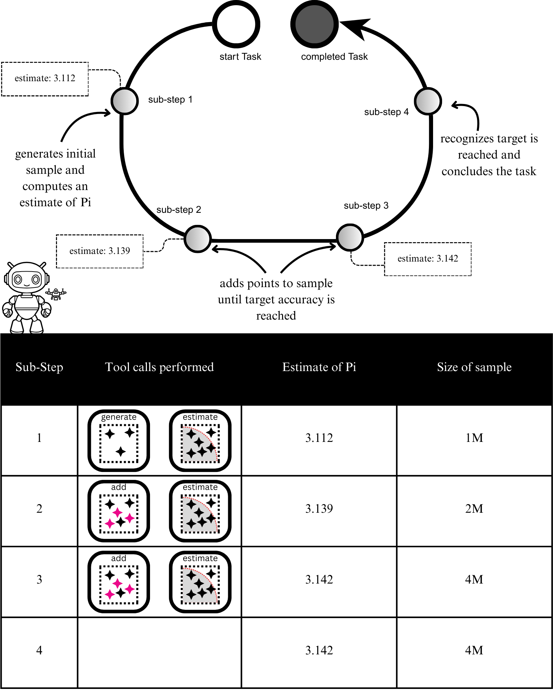
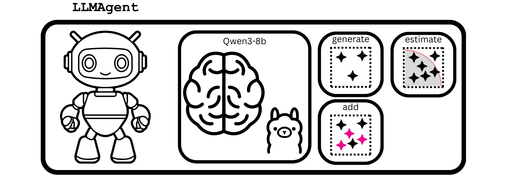
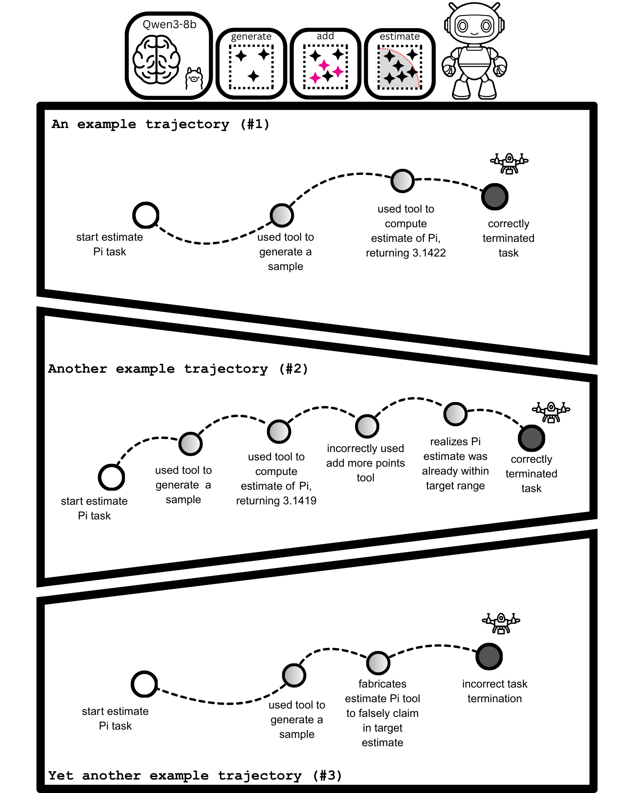

<!-- markdownlint-disable-file MD001 MD033 MD046 -->
# Capstone I: Monte Carlo Estimation of Pi

!!! info "About this capstone"
    This capstone was originally drafted as a chapter for
    *Build a Multi-Agent System — With MCP and A2A* (Manning). It is published here as
    a standalone companion resource for readers who have completed Part 1 of the book
    and built their first `LLMAgent`.

!!! abstract "What this capstone covers"
    - The task of curating random samples to estimate Pi
    - Evaluating LLM agents on task success
    - Using LLM as a Judge to evaluate trajectories of task executions

Welcome to the first Capstone project! We'll put what we've learned and built — tools,
LLMs, and the `LLMAgent` class — into practice with a concrete, end-to-end application.

We'll task an LLM agent to curate collections of random numbers, called random samples,
from which precise estimates of Pi can be computed. We'll create the tools the LLM agent
requires to generate these random samples and estimate Pi, which it will need to use
correctly and repeatedly to perform the task successfully. Since Pi is known, the
determination of task success is fully verifiable, making it a good example for teaching
and learning the fundamentals of evaluating LLM agents.

I've prepared a Jupyter notebook containing all the code for this Capstone project,
which you can use to follow along as you read. Since we're building an application
rather than adding to our framework's source code, all code listings are contained in
the Capstone's dedicated [notebook](capstone_1.ipynb).

Launch Jupyter with `uv` by running the following terminal command from the root
directory of this book's code:

```sh
uv run --with jupyter jupyter lab
```

Once Jupyter has launched, navigate to and open `capstones/one/capstone_1.ipynb`.

---

## Monte Carlo estimations of Pi

To understand the task that we'll ask our LLM agent to perform, we need to know how
Monte Carlo estimation works. The Monte Carlo method is a statistical technique that
involves simulating random numbers and using them to estimate specific values of
interest. In statistical terms, these random numbers are sampled from a probability
distribution and used to estimate expected values of random variables. However, we'll
skip these formalities and instead focus on the algorithm for applying the Monte Carlo
method to estimate Pi.

The first step of the algorithm is to generate a random sample of `N` points
`{(x_i, y_i) : i=1,..,N}` within the unit square `[0,1] x [0,1]`, as shown in
Figure 1.

<figure markdown="span">
  ![Figure 1: A random sample of N=10 points generated within the unit square [0,1] x [0,1].](assets/figure_1.png)
  <figcaption>Figure 1: A random sample of N=10 points generated within the unit square [0,1] x [0,1].</figcaption>
</figure>

We generate a random point by generating two random numbers between 0 and 1, one for
its x coordinate and another for its y coordinate.

In the second step, we'll overlay the quarter-circle of radius 1 centered at the origin
within our unit square, as shown in Figure 2.

<figure markdown="span">
  
  <figcaption>Figure 2: Overlaying the quarter-circle within the unit square.</figcaption>
</figure>

Crucially, the ratio of the area of this quarter-circle to that of the unit square turns
out to be precisely Pi / 4. And the Monte Carlo estimate for this ratio is simply the
proportion of points in our random sample that lie inside the quarter-circle. Finally, a
simple rearrangement gives us our estimate of Pi: the proportion of points in our random
sample that reside in the quarter-circle multiplied by 4.

For example, the random sample shown in Figure 2 has all points, except 5 and 8, lying
within the quarter-circle. Thus, the estimate of Pi from this random sample would be
8/10 × 4 = 3.2. This estimate is close to Pi (3.14159265), but not very accurate.

The good news is that Monte Carlo estimations of Pi get more accurate as we increase the
number of points in our random sample. For this Capstone project, we'll instruct our LLM
agent to continue expanding the number of points in a single random sample until the
desired accuracy for our estimate of Pi is achieved.

!!! note
    It's important that the random points be uniformly distributed within the unit
    square. We'll use the `numpy` library and its pseudo-random number generators, which
    have the required statistical properties of randomness.

---

## Tools for estimating Pi

Now that we have a good grasp on how Monte Carlo estimation of Pi works, let's create
the tools our LLM agent will use. We'll use three tools: one for generating a random
sample, another for adding more points to an existing random sample, and a third for
computing Monte Carlo estimates. Figure 3 shows these three tools and their
functionalities.

<figure markdown="span">
  
  <figcaption>Figure 3: The three tools our LLM agent will use to build random samples and estimate Pi.</figcaption>
</figure>

### A tool for generating random samples

The first tool generates a new random sample of points within the unit square. We'll
implement this tool as a `PydanticFunctionTool`, as covered in the book.

Our tool wraps a function that takes in a single parameter specifying the desired number
of points. It then builds the random sample, stores it in a registry, and finally outputs
a data structure that contains the sample's assigned ID and size. The following code
implements our tool for generating random samples.

#### Listing 1: A tool for generating random samples

```python
import uuid
import numpy as np
from pydantic import BaseModel, ConfigDict, Field, computed_field
from llm_agents_from_scratch.tools import PydanticFunctionTool


SAMPLE_REGISTRY: dict[str, list[tuple[float, float]]] = {}  # (1)!


class RandomSampleParams(BaseModel):  # (2)!
    """Params for generate_random_sample."""

    model_config = ConfigDict(extra="forbid")
    n: int = Field(description="The number of random points to generate")


class RandomSample(BaseModel):
    """Result from generate_random_sample."""

    sample_id: str = Field(
        description="Pass this sample_id to monte_carlo_estimate",
    )

    @computed_field
    @property
    def sample_size(
        self,
    ) -> int:
        """Determine n from SAMPLE_REGISTRY."""
        return len(SAMPLE_REGISTRY[self.sample_id])

    def __str__(self) -> str:
        return self.model_dump_json()


def generate_random_sample(params: RandomSampleParams) -> RandomSample:  # (3)!
    """Generate n random points in [0, 1] × [0, 1].

    Returns a sample_id. Pass this sample_id directly to
    monte_carlo_estimate.
    """
    pts = np.random.uniform(size=(params.n, 2))  # (4)!
    sample_id = str(uuid.uuid4())  # (5)!
    SAMPLE_REGISTRY[sample_id] = [tuple(pt) for pt in pts.tolist()]  # (6)!
    return RandomSample(sample_id=sample_id)  # (7)!


random_sample_tool = PydanticFunctionTool(generate_random_sample)  # (8)!
```

1. A simple registry for random samples
2. The Pydantic BaseModel for the tool's parameters
3. The wrapped function
4. Generate the random points in the unit square using numpy
5. Assign a new ID to the random sample
6. Store the sample in the registry
7. Returns a data structure specifying the ID and size of the random sample
8. Turn the function into a tool by using `PydanticFunctionTool`

To see the tool in action, we can create a `ToolCall` object and pass it to our
`random_sample_tool`, as shown in the following code.

```python
from llm_agents_from_scratch.data_structures import ToolCall

rs_tool_call = ToolCall(  # (1)!
    tool_name=random_sample_tool.name,
    arguments={"n": 5000},  # (2)!
)
rs_tool_call_result = random_sample_tool(rs_tool_call)  # (3)!
rs_tool_call_result
```

1. The ToolCall object containing the arguments for our generate random sample tool
2. Arguments for generating a random sample of size n=5000
3. Executing the tool call with the `random_sample_tool`

As you learned in the book, the output of a `BaseTool` is a `ToolCallResult`. Like
`SimpleFunctionTool`, a `PydanticFunctionTool` serializes the result of its wrapped
function into a string, which gets assigned to the `content` field of the returned
`ToolCallResult` object. The output of the final statement in the previous code snippet
should then look something like this:

```text
ToolCallResult(tool_call_id='2397e50c-39d8-4cef-83a0-fcdafed92b61',
content='{"sample_id":"85080bb3-fe3c-4005-a144-
d393ace9f0d4","sample_size":5000}', error=False)
```

Here, `content` is a JSON-string serialization of the `RandomSample` object returned by
the wrapped function, `generate_random_sample()`.

!!! info "LLMs as random number generators"
    You may wonder whether we can use LLMs to generate our random samples instead of a
    proper pseudo-random number generator, such as the one used in `numpy`. While LLMs
    are indeed powerful generative models, they cannot be used for every task, and for
    now, this includes random-number generation.

    This is because LLMs are trained on the next-token prediction task, so they generate
    sequences of numbers that appear random, but fail to meet the statistical criteria for
    randomness, such as uniformity.

!!! example "Exercise 1: Getting an LLM to produce a random sample"
    Use the structured output interaction to have an LLM produce a set of 10,000
    "random" numbers between 0 and 1,000. Afterwards, divide these numbers by 1,000 so
    that they fall between 0 and 1. Plot a histogram of these numbers. What can you say
    about the histogram and the LLM's ability to produce pseudo-random numbers?

### A tool for adding points to an existing random sample

Let's now write code for our second tool, which can add random points to any sample
registered in our random sample store. For the wrapped function of this tool, we'll have
two input parameters: one specifying the sample ID we want to expand, and a second
specifying the number of new points we want to add. This function then generates the
required number of new points within the unit square and uses them to augment the
specified random sample. As output, it returns a data structure like the one returned by
`generate_random_sample()`.

The implementation follows a similar approach as before, using `PydanticFunctionTool`,
as shown in the following code listing.

#### Listing 2: A tool for adding more points to an existing random sample

```python
class AddPointsParams(BaseModel):  # (1)!
    """Params for add_more_points_to_sample."""

    model_config = ConfigDict(extra="forbid")
    sample_id: str = Field(
        description="The sample_id of the sample to augment",
    )
    n: int = Field(
        description="The number of random points to generate",
    )


def add_more_points_to_sample(params: AddPointsParams) -> RandomSample:  # (2)!
    """Add n more random points to an existing random sample.

    Returns a sample_id and the total number of points.
    """
    pts = np.random.uniform(size=(params.n, 2))  # (3)!
    # augment sample
    SAMPLE_REGISTRY[params.sample_id] += [  # (4)!
        tuple(pt) for pt in pts.tolist()
    ]
    return RandomSample(sample_id=params.sample_id)


# create tool
add_more_points_tool = PydanticFunctionTool(add_more_points_to_sample)
```

1. The tool's parameters model to specify sample ID and the number of new points to add
2. The wrapped function
3. Generate the additional random points in the unit square
4. Augmenting the specified sample with the new points

Let's test this tool by adding more points to the random sample we created earlier. To
do this, we'll first need to pull the sample ID from the `ToolCallResult` object that
was returned by our `random_sample_tool`. We'll deserialize the `content` string back to
a `RandomSample` object, which has the `sample_id` attribute we need.

With our sample ID in hand, we can create a new `ToolCall` object for the
`add_more_points_tool` to execute. The following code adds 500 more points to our random
sample from before.

```python
# get the sample ID of the previous random_sample_tool() invocation
random_sample = RandomSample.model_validate_json(  # (1)!
    rs_tool_call_result.content
)
# build tool call for add more points
add_pts_tool_call = ToolCall(
    tool_name=add_more_points_tool.name,  # (2)!
    arguments={
        "sample_id": random_sample.sample_id,  # (3)!
        "n": 500,  # (4)!
    },
)
add_pts_tool_call_result = add_more_points_tool(add_pts_tool_call)  # (5)!
add_pts_tool_call_result
```

1. Deserializing the content back to a `RandomSample`
2. Target the new add more points tool
3. Supply the sample ID of the previously generated random sample
4. Specifying to add 500 more points to the random sample
5. Executing the tool call

The output of the previous code snippet is another `ToolCallResult` object, whose
`content` should indicate an increase in the sample's size to 5500 (from the original
5000). It should look something like the following:

```text
ToolCallResult(tool_call_id='c01cc935-f33c-4543-9b7e-77b6d4006353',
content='{"sample_id":"85080bb3-fe3c-4005-a144-
d393ace9f0d4","sample_size":5500}', error=False)
```

!!! example "Exercise 2: Adding more points to a non-existent random sample"
    Tool call executions can fail. When they do, the returned `ToolCallResult` contains
    information about the failure, which LLMs can use to correct erroneous tool-call
    requests. Create a new `ToolCall` with a sample ID that doesn't exist in your sample
    registry and pass it to the `add_more_points_tool` to execute. What do the `content`
    and `error` fields of the returned `ToolCallResult` object look like?

### A tool for computing Monte Carlo estimates

Our last tool estimates Pi from a random sample by finding the proportion of points in
the unit square that lie within the overlaid quarter-circle, then multiplying by 4.

The wrapped function of this tool takes in a single parameter: the ID of the random
sample to use. It then determines the number of points in the random sample that lie
inside the quarter-circle. Note that a point `(x, y)` lies in the quarter-circle if
`x**2 + y**2 <= 1`. (This inequality is derived from the equation of the quarter-circle,
given by `x**2 + y**2 = 1`, where `0 <= x, y <= 1`.)

As output, it returns a data structure containing the estimate of Pi, the sample ID, and
the sample size. The following code implements this final tool as a `PydanticFunctionTool`.

#### Listing 3: A tool for computing the Monte Carlo estimate of Pi from a random sample

```python
class MonteCarloEstimateParams(BaseModel):  # (1)!
    """Params for monte_carlo_estimate."""

    model_config = ConfigDict(extra="forbid")
    sample_id: str = Field(
        description="The sample_id returned by generate_random_sample",
    )


class MonteCarloEstimateResult(BaseModel):  # (2)!
    """Results for monte_carlo_estimate."""

    sample_id: str
    sample_size: int
    estimate: float

    def __str__(self) -> str:
        return self.model_dump_json()


def monte_carlo_estimate(  # (3)!
    params: MonteCarloEstimateParams,
) -> MonteCarloEstimateResult:
    """Estimate pi using Monte Carlo method.

    Args:
        params: Contains sample_id from generate_random_sample.

    Returns:
        Estimate of pi (float).
    """
    points = SAMPLE_REGISTRY[params.sample_id]
    n = len(points)
    inside = sum((x**2 + y**2) < 1 for x, y in points)  # (4)!
    return MonteCarloEstimateResult(
        estimate=(inside / n) * 4,  # (5)!
        sample_id=params.sample_id,
        sample_size=n,
    )


# create tool
monte_carlo_estimate_tool = PydanticFunctionTool(monte_carlo_estimate)
```

1. The Pydantic BaseModel for the tool's parameters
2. The data structure our wrapped function returns
3. The wrapped function
4. Determine the number of points that lie in the quarter-circle
5. The Monte Carlo estimate of Pi

To wrap up this section, let's calculate the Monte Carlo estimate of Pi using our random
sample from earlier. Our tool requires only the sample ID, which we already obtained by
deserializing the `content` of the `ToolCallResult` object returned by our
`random_sample_tool`.

```python
# build tool call for estimating Pi
mc_estimate_tool_call = ToolCall(
    tool_name=monte_carlo_estimate_tool.name,  # (1)!
    arguments={
        "sample_id": random_sample.sample_id,  # (2)!
    },
)
mc_estimate_tool_call_result = monte_carlo_estimate_tool(  # (3)!
    mc_estimate_tool_call
)
mc_estimate_tool_call_result
```

1. A new tool call targeting `monte_carlo_estimate_tool`
2. Supply the sample ID of our random sample
3. Executing the tool call

The returned `ToolCallResult` object in the previous code snippet should contain our
estimate of Pi and should look something like this:

```text
ToolCallResult(tool_call_id='9dbb6ac5-5c05-4b7f-911d-e85235f4fece',
content='{"sample_id":"85080bb3-fe3c-4005-a144-
d393ace9f0d4","sample_size":5500,"estimate":3.0945454545454547}',
error=False)
```

Great! We just tested our tools in an end-to-end fashion and ultimately obtained an
estimate of Pi of 3.0945 from a sample of size 5500. To increase the accuracy of this
estimate, we could add more points to our sample. This is precisely what we'll want our
LLM agent to recognize and do automatically.

Let's move on to defining the task that our LLM agent will perform.

!!! example "Exercise 3: Estimating Pi with our LLM generated random numbers"
    Use the "random" numbers generated by an LLM from Exercise 1 to estimate Pi using
    the same logic from the `monte_carlo_estimate` tool. What can you say about this
    estimate of Pi?

---

## Defining the Task

For this Capstone, we'll have our LLM agent curate random samples that yield Pi estimates
accurate to the first three decimal places; that is, 3.142 when rounded. As Monte Carlo
estimates improve with larger sample sizes, our LLM agent will need to generate a random
sample and continue adding more points until the desired level of accuracy is reached.
It will need to use our three tools, some of which will be used repeatedly throughout
the task execution. Figure 4 shows how our LLM agent should ideally use our three tools
to perform the task.

<figure markdown="span">
  
  <figcaption>Figure 4: An ideal task execution performed by our LLM agent. It creates a single random sample and adds points until the estimate of Pi is accurate to three decimal places.</figcaption>
</figure>

| Sub-Step | Tool calls performed | Estimate of Pi | Size of sample |
| -------- | -------------------- | -------------- | -------------- |
| 1 | generate + estimate | 3.112 | 1M |
| 2 | add + estimate | 3.139 | 2M |
| 3 | add + estimate | 3.142 | 4M |
| 4 | *(none)* | 3.142 | 4M |

The LLM agent should start the task execution by generating a new random sample using
the `random_sample_tool`. It should then compute the estimate of Pi from it by invoking
the `monte_carlo_estimate_tool`. If the estimate is not at the desired level of accuracy,
it should call `add_more_points_tool` to increase the random sample size. Afterwards, it
should recompute the estimate of Pi by making another call to `monte_carlo_estimate_tool`.
Our LLM agent should cycle through `add_more_points_tool` and `monte_carlo_estimate_tool`
until the estimate of Pi is accurate to three decimal places.

!!! note
    In Figure 4, the LLM agent is shown to make multiple tool calls in a single
    sub-step. However, another valid, though perhaps slightly less efficient execution
    would have these multiple tool calls spread across separate sub-steps. In other
    words, one sub-step adds more points to the random sample, and the next sub-step
    recomputes the estimate of Pi.

While this represents the ideal execution trajectory, you can probably already think of
some likely failure modes for this task. One such failure mode is the LLM agent not
sticking to a single random sample, generating new ones rather than reusing the same
one. Another failure mode would be a hallucinated tool-call result. A common way to
reduce the chances of these failures occurring is to explicitly tell the LLM agent what
to avoid in the task instruction.

At a minimum, task instructions should include a description of the task's main target
or goal. Depending on the task's complexity, task instructions may include more detailed
task instructions, exemplars demonstrating successful task execution, formatting
guidelines, and rules or guardrails to mitigate known failure modes. A well-structured
prompt organizes separate sections for each of these. The following code listing shows
the task instruction that we'll ultimately pass to our LLM agent.

#### Listing 4: Writing the task instruction for our LLM agent

```python
instruction = """
You are tasked with estimating pi using Monte Carlo methods.

TARGET: Get an estimate accurate to 3 decimal places.
Success means the estimate falls in the range [3.1415, 3.1425).
Any value from 3.1415 up to (but not including) 3.1425 is a success.

Examples:
- 3.14159 ✓ (within range)
- 3.14200 ✓ (within range)
- 3.14149 ✗ (too low)
- 3.14250 ✗ (too high)

<algorithm>
1. Call generate_random_sample(1000000) to start with 1M points
2. Call monte_carlo_estimate(sample_id) to get estimate
3. Check: is the estimate between 3.1415 and 3.1425?
   - YES → Report success and STOP
   - NO → Continue to step 4
4. Call add_more_points_to_sample, doubling the points each time:
   - First add: 1 million
   - Second add: 2 million
   - Third add: 4 million
   - And so on, doubling each iteration
5. After adding points, go back to step 2

Exponential growth ensures faster convergence while demonstrating adaptive
sampling.
</algorithm>

<critical_rules>
- If the task is not complete, your response MUST contain a tool call
- Do not just describe what you plan to do—actually call the tool
- Do not stop until the estimate falls within the target range
- Keep track of your iteration to calculate the correct doubling amount
- NEVER fabricate tool results—only use actual tool responses
- NEVER invent a sample_id
</critical_rules>

<final_output>
When the estimate reaches the target precision, respond with this exact
JSON structure and nothing else:

{"sample_id": "<the-actual-sample-id-from-tool-response>"}

No explanation, no markdown formatting, no code blocks—just the raw JSON.
</final_output>

Begin by calling generate_random_sample(1000000).
""".strip()
```

The instruction covers: the target or objective of the task, examples of successful
and unsuccessful estimates, more detailed instructions on how to perform the task,
rules to help avoid known failure modes, and output format guidelines. To mark the
separate sections, we use XML tags, a popular choice for creating structured prompts.

All that remains is to package our instruction into a `Task` object that our LLM agent
can process. The following code does just this.

#### Listing 5: Defining the Task for our LLM agent

```python
from llm_agents_from_scratch.data_structures import Task

task = Task(
    instruction=instruction,  # (1)!
)
```

1. Using our written task instruction from Listing 4

!!! info "The process for establishing task instructions that work"
    Creating good task instructions involves trial and error. While today's LLMs are
    undoubtedly powerful, they often still require a bit of handholding for complex
    tasks. This translates into precise task instructions or prompts to promote a
    specific execution trajectory for the LLM agent. In the future, as LLMs become even
    stronger, task instructions may become more robust, allowing LLM agents to determine
    correct paths on their own.

    In establishing our task instruction, I found that I needed to nudge our LLM agent
    (with Qwen3 as the backbone LLM) to use exponentially growing sample sizes. It didn't
    recognize that Monte Carlo estimates for Pi converge slowly and was often adding a
    small, consistent number of new points to the sample. Also, after some trial and
    error, I settled on starting the sample at 1M points. I initially set the sample
    size to 100K points, but this led to long-running task executions, which made it less
    likely that the LLM agent would adhere to the stated output format. Starting at 1M
    points and using an exponentially growing schedule for adding new points increased
    the task success rate.

    Finally, I highly recommend using LLMs to draft instructions and prompts in general,
    as they can help create well-structured prompts quickly. To establish our task
    instruction, I used Claude to create the original draft and guided it based on my
    experience to make appropriate refinements.

---

## Running the Task with our LLM agent

With our task well established, let's construct an LLM agent to process it. We'll use
an `OllamaLLM` with Qwen3-8b as the backbone LLM and equip it with our three tools, as
shown in Figure 5.

<figure markdown="span">
  
  <figcaption>Figure 5: Our LLM agent that will perform the task of curating random samples to estimate Pi to three decimal places of accuracy.</figcaption>
</figure>

The following code creates our LLM agent.

#### Listing 6: Creating our LLM agent

```python
from llm_agents_from_scratch import LLMAgent
from llm_agents_from_scratch.llms import OllamaLLM


backbone_llm = "qwen3:8b"  # (1)!
llm = OllamaLLM(backbone_llm)
llm_agent = LLMAgent(
    llm=llm,
    tools=[  # (2)!
        random_sample_tool,
        add_more_points_tool,
        monte_carlo_estimate_tool,
    ],
)
```

1. This is established at the beginning of the notebook
2. Equip our LLM agent with our three tools

You learned in the book that to have our LLM agent perform the task we defined earlier,
we simply pass the task to its `run()` method. For this task, we'll also specify a
maximum number of steps. We'll set a limit that still gives our LLM agent a reasonable
chance of succeeding at the task, while also letting us know when it's going down a
suboptimal trajectory. The following code accomplishes this.

```python
MAX_STEPS = 20  # (1)!
handler = llm_agent.run(task, max_steps=MAX_STEPS)
```

1. Defined at the beginning of the notebook

Once the task has finished, we can get the result from the `handler` object if it
completed successfully. Otherwise, we can access the encountered error as shown in the
following code.

```python
result = handler.exception() or handler.result()  # (1)!
result
```

1. The `exception()` method returns `None` if no error was encountered

Upon successful execution, the final statement of the previous code snippet should look
something like this:

```text
TaskResult(task_id='e20397d3-371b-4480-83df-9688ea0b0ce8', content='{"sample_id":
"c0dfca1f1-023c-4202-b21c-ae586a5c2594"}')
```

!!! note
    In the notebook, logging is enabled, giving you greater visibility into task
    execution. The notebook also displays the task execution rollout, should you want to
    inspect it.

In this case, the LLM agent adhered to our final output instructions by returning only
the ID of its random sample. Of course, we'll also want to verify whether the LLM agent
successfully built a sample that yields an estimate of Pi accurate to three decimal
places. We'll perform this evaluation and analyze the task trajectory taken by our LLM
agent next.

---

## Evaluating our LLM agent

Our LLM agent returned the sample ID as we asked it to, but does the sample actually
exist in the sample registry, and if so, does it yield an estimate of Pi accurate to
three decimal places?

We'll evaluate our LLM agent from two angles. The first assesses the correctness or
success of the task execution, while the second analyzes our LLM agent's task trajectory
to evaluate its overall efficiency and spot any hallucinations.

### Evaluating Task Success

We can assess the correctness of our LLM agent's task execution by simply computing the
Monte Carlo estimate and checking whether it is accurate to three decimal places of Pi.
To do this, we'll need to parse the final output of the LLM agent to extract the
sample's ID and then pass it to the wrapped function of our `monte_carlo_estimate_tool`.
If we encounter any errors related to parsing the output or an inability to retrieve the
specified random sample from the sample registry, we can safely attribute them to our
LLM agent's failure to perform the task correctly. We'll also count errors encountered
by the LLM agent during task execution as task failure.

The following listing implements an `is_task_success()` function that takes a
`TaskHandler` and determines whether the task succeeded.

#### Listing 7: Determining task success

```python
import json
from json import JSONDecodeError
from pydantic import ValidationError


def estimate_has_target_precision(
    estimate: MonteCarloEstimateResult,
) -> bool:
    """Checks if the estimate achieved the desired precision."""  # (1)!
    upper_bound = 3.1425
    lower_bound = 3.1415
    return lower_bound <= estimate.estimate < upper_bound


def is_task_success(
    handler: LLMAgent.TaskHandler,
    verbose: bool = False,
) -> bool:
    """Determines task success."""  # (2)!
    if handler.exception():
        if verbose:
            print(handler.exception())
        return False  # (3)!

    result = handler.result()
    try:
        output_data = json.loads(result.content)
        sample_id = output_data["sample_id"]
        params = MonteCarloEstimateParams(
            sample_id=sample_id,
        )
        estimate = monte_carlo_estimate(params)  # (4)!
        if verbose:
            print(
                f"Estimate: {estimate}",
            )
        return estimate_has_target_precision(estimate)  # (5)!
    except (ValidationError, KeyError, JSONDecodeError) as e:
        # invalid sample_id provided by LLM agent—unsuccessful task
        if verbose:
            print(f"The LLM agent returned an invalid output: {str(e)}.")
        return False  # (6)!
```

1. Docstring suppressed for brevity
2. Docstring suppressed for brevity
3. Errors encountered during task execution count as a task failure
4. Computing the estimate of Pi using the wrapped function of `monte_carlo_estimate_tool`
5. Checking if the estimate is accurate to three decimal places
6. Errors due to output parsing or non-existent samples also count as a task failure

Let's use the `is_task_success()` function to see if our LLM agent managed to perform
the task successfully. We'll set `verbose` to `True` to get a bit more detail on the
task success determination.

```python
is_task_success(handler, verbose=True)
```

The previous code snippet should (hopefully) produce an output like the following:

```text
Estimate: {"sample_id":"81825dff-e5ef-4259-beaf-
61a8f1a7b139","sample_size":1000000,"estimate":3.141852}
True
```

Our LLM agent did, in fact, perform the task successfully!

### Evaluating LLM agent trajectories

While the correctness of an LLM agent's final output is usually the most critical
evaluation metric, it can also be valuable to assess how it got to this output.

Ideally, the LLM agent was efficient, using only a small number of sub-steps to get to
the correct answer. However, because LLM agents are non-deterministic, they may get
off-track and need to course-correct during task execution. At worst, the LLM agent
could make errors that are difficult to recover from, significantly decreasing the chance
of task success. Even in these situations, assessing how your LLM agent arrived at those
irrecoverable errors helps you identify failure modes that you can address. Figure 6
shows various trajectories that our LLM agent may take for our task.

<figure markdown="span">
  
  <figcaption>Figure 6: Three examples of task execution trajectories that our LLM agent could take.</figcaption>
</figure>

The first example depicts our LLM agent taking an ideal execution path, requiring an
efficient number of sub-steps to perform the task correctly. In contrast, the second
example trajectory is less efficient since our LLM agent failed to realize it had already
reached the target accuracy in the second sub-step. Finally, the third example shows a
failure mode in which the LLM agent hallucinates a tool call that fabricates an in-range
estimate of Pi, leading to premature task termination.

To formally analyze the trajectory of our LLM agent's earlier task execution, we'll
apply the popular LLM as a Judge technique. We'll pass our LLM agent's task rollout to
another LLM (i.e., the judge LLM), along with a rubric for it to evaluate the rollout
and determine whether any failure modes or inefficiencies occurred. The rubric contains
several yes/no questions about the trajectory for the judge LLM to answer, such as
whether the LLM agent always added points before re-estimating Pi and whether the task
was prematurely terminated. We'll also ask the judge LLM to provide a written summary
of the trajectory analysis. The listing below implements our trajectory evaluation
rubric.

#### Listing 8: A rubric for analyzing a task execution trajectory

```python
class TrajectoryEvalRubric(BaseModel):
    """Rubric for evaluating an execution trajectory."""

    reached_target_precision: bool = Field(
        description="True if agent achieved estimate that rounds to 3.142",
    )
    completed_without_max_steps: bool = Field(
        description="True if agent completed task without hitting max steps limit",
    )
    always_added_points_before_reestimating: bool = Field(
        description=(
            "False if agent called monte_carlo_estimate consecutively "
            "more than once before adding points"
        ),
    )
    reused_sample: bool = Field(
        description=(
            "True if agent used add_more_points_to_sample to grow the "
            "sample instead of creating new samples"
        ),
    )
    no_false_completion: bool = Field(
        description=(
            "True if agent only claimed success when the actual tool "
            "result showed 3.142. False if agent claimed convergence "
            "based on a fabricated or misread estimate."
        ),
    )
    no_missed_completion: bool = Field(
        description=(
            "True if agent stopped when estimate reached 3.142. False if "
            "agent continued adding points after already achieving target."
        ),
    )
    followed_output_format: bool = Field(
        description=(
            "True if agent's final response contained only the sample_id "
            "as instructed, with no additional text or explanation."
        ),
    )
    largest_sample_size: int | None = Field(
        description=(
            "The largest sample size achieved during the trajectory, "
            "or None if not determinable from tool outputs"
        ),
    )
    summary: str = Field(
        description="One sentence summary of trajectory quality",
    )
```

We've implemented this rubric as a `pydantic.BaseModel` because we'll perform our
trajectory evaluation via the structured output LLM interaction mode covered in the
book.

In addition to the rubric, which will serve as our output model, we also need to provide
the judge LLM with evaluation instructions. We'll provide context around the task our
LLM agent was given and the tools it had to perform it. We'll also ground the judge LLM
with our definition of correct agent behavior. At the very end of these instructions,
we'll provide our LLM agent's final response and its task trajectory. The following code
shows our instruction prompt template for the judge LLM.

#### Listing 9: Instruction prompt for the judge LLM

```python
judge_prompt_template = """
Evaluate this Monte Carlo pi estimation trajectory.  # (1)!

The agent had three tools:
- `generate_random_sample(n)` - Creates NEW sample
- `add_more_points_to_sample(sample_id, n)` - Adds points to EXISTING sample
- `monte_carlo_estimate(sample_id)` - Returns pi estimate

Correct behavior:  # (2)!
1. Create sample once
2. Estimate → if not between 3.1415 and 3.1425,
   add points → re-estimate → repeat
3. When target reached, respond with ONLY the sample_id (no other text)

Note: If final_response is "Max steps error", the agent failed to complete
the task within the allowed number of steps.

HALLUCINATION MARKER: If you see "⇨ assistant: ↳ tool:" in the trajectory,
the agent fabricated a tool response instead of waiting for the actual
result.
This is a critical failure—set no_false_completion to False.

<final_response>
{result}  # (3)!
</final_response>

<trajectory>
{trajectory}  # (4)!
</trajectory>

Evaluate and submit your judgment.""".strip()
```

1. Context for the task and the tools our LLM agent was provided
2. Grounding the judge LLM with the definition of correct behaviour
3. We'll supply the LLM agent's final output here
4. We'll supply the task execution trajectory here

We have everything we need now to perform the trajectory evaluation. For the judge LLM,
we can use the same LLM that we're using for our LLM agent, or a different one entirely.
The following code performs our trajectory evaluation with an `OllamaLLM` as the judge
LLM, calling its `structured_output()` method to return a completed evaluation rubric
containing its analysis.

```python
judge_llm = "qwen3:8b"  # (1)!
trajectory_judge = OllamaLLM(model=judge_llm)  # (2)!
trajectory_eval = await trajectory_judge.structured_output(  # (3)!
    prompt=judge_prompt_template.format(
        result=str(result),
        trajectory=handler.rollout,
    ),
    mdl=TrajectoryEvalRubric,
)
print(trajectory_eval.model_dump_json(indent=4))
```

1. This is defined at the beginning of the Jupyter notebook
2. The same model as our backbone LLM
3. Performing trajectory evaluation via the structured output LLM interaction mode

The code above prints the completed evaluation as a JSON string, and should look
something like this:

```json
{
    "reached_target_precision": true,
    "completed_without_max_steps": true,
    "always_added_points_before_reestimating": true,
    "reused_sample": true,
    "no_false_completion": true,
    "no_missed_completion": true,
    "followed_output_format": true,
    "largest_sample_size": 7000000,
    "summary": "The agent successfully completed the task by following the
algorithm, adding points when the estimate was not accurate enough, and
returning the correct sample_id once the estimate fell within the target
range. No false completions or hallucinations were observed."
}
```

Based on the judge LLM's analysis, our LLM agent successfully performed the task, was
efficient, and avoided the failure modes we identified earlier.

### Evaluations with another BaseLLM subclass: OpenAILLM

It's good practice to use a different model for the judge LLM to avoid potential
bias in your LLM agent evaluations. When using an open-source model for your LLM
agent, one good option might be to use a closed-source model as the judge LLM.
Closed-source models tend to outperform their open-source counterparts across most
of the popular LLM benchmarks and thus make strong candidates for judge LLMs.

To that end, I have added another `BaseLLM` subclass to our framework, called
`OpenAILLM`, which will allow us to use any OpenAI LLM. This new class `OpenAILLM`
can be used only after installing the `openai` extra of our framework, which can be
done using either of the following terminal commands when in the root directory of
this book's code:

```sh
# to install from source with uv
uv sync --extra openai

# to install from source with pip
pip install -e ".[openai]"
```

Usage patterns for `OpenAILLM` are like those of `OllamaLLM` (since both are
`BaseLLM` subclasses). One notable difference is that you'll have to pass in a valid
API key to interact with OpenAI's models. The following code shows how to perform
the trajectory evaluation with an `OpenAILLM`.

```python
from llm_agents_from_scratch.llms.openai import OpenAILLM

judge_llm = "gpt-5"  # (1)!
trajectory_judge = OpenAILLM(
    model=judge_llm,
    api_key=...,  # (2)!
)
trajectory_eval = await trajectory_judge.structured_output(  # (3)!
    prompt=judge_prompt_template.format(
        result=str(result),
        trajectory=handler.rollout,
    ),
    mdl=TrajectoryEvalRubric,
)
```

1. You still need to specify the model you want to use
2. You'll need to now supply a valid API key for OpenAI
3. The structured output call is the same as it was for `OllamaLLM`

You can also use the `OPENAI_API_KEY` environment variable to supply your API key.
If no `api_key` parameter is provided at construction, `OpenAILLM` will try to
resolve it from this environment variable.

!!! tip
    The Jupyter notebook for this capstone project contains code that determines the
    judge LLM based on the existence of an `OPENAI_API_KEY` environment variable. If
    you have a valid API key and want to use the OpenAI model specified in this
    notebook as your judge LLM, I recommend setting the required environment variable
    before launching the Jupyter notebook with the terminal command
    `export OPENAI_API_KEY=<your-api-key>`.

---

## Repeated trials for a more reliable evaluation

Since LLM agents are non-deterministic, we'll want to base our evaluations on more than
one run. By repeating task executions, we can gain a more accurate estimate of average
task success and more reliable insight into the LLM agent's predominant behaviors.

We'll wrap up this Capstone by having our LLM agent repeat the task we just executed
across multiple independent trials. We'll then perform the same evaluations as in the
previous section for each of these individual runs and aggregate their scores to obtain
a more trustworthy estimate of task performance.

The following code performs a specified number of repeated task executions with our LLM
agent, maintaining each returned `TaskHandler` object in a list.

##### Listing 10: Repeated task execution runs with our LLMAgent

```python
NUM_REPLICATIONS = 10  # (1)!

handlers = []  # (2)!
for _ in range(NUM_REPLICATIONS):
    h = llm_agent.run(task, max_steps=MAX_STEPS)  # (3)!
    handlers.append(h)
```

1. The number of repeated task executions—this is specified at the beginning of the Jupyter notebook
2. Our list for maintaining the `TaskHandler` objects for each run
3. Repeated runs of the same task

!!! info "Concurrent executions with TaskHandler"
    Thanks to the design of our `LLMAgent.run()` method, it's easy to achieve concurrent
    execution for our repeated trials. This is because each `run()` invocation returns
    its own `TaskHandler` that can be completely isolated from the others. We must only
    be mindful if separate task execution runs share a single data resource, and there is
    potential for data races.

    For our current task, while the `SAMPLE_REGISTRY` is a shared resource, since sample
    IDs are based on UUIDs (i.e. universally unique identifiers), the risk of two
    separate task executions writing to the same data is infinitesimally small. In other
    words, we should be fine without using any `asyncio` primitives, such as locks, for
    preventing data races across our repeated runs.

We can check on the status of each task execution run by calling the `done()` method of
its corresponding `TaskHandler`. From the book, you know that a completed `TaskHandler`
resolves to a `TaskResult` unless an error was encountered during task execution. The
following code shows how to extract either the exception or the result if a handler is
done.

```python
[str(h.exception() or h.result()) if h.done() else "Not Done" for h in handlers]
```

The output of this code will let us know which task executions have completed, and which
need more time. It should look something like the following:

```python
['Not Done',                               # (1)!
 '{"sample_id": "6e9e4898-3cd8-41ff-be63-8ad5777ab7fa"}',   # (2)!
 '{"sample_id": "c1899d52-78a4-4775-ad54-eb501ada983d"}',
 'Not Done',
 'Not Done',
 '{"sample_id": "70013709-5960-4bd9-ba4f-407d506276f4"}',
 '{"sample_id": "4bbd5b65-68d6-43ab-bd8c-591a60596089"}',
 '{"sample_id": "e67b9888-bd96-4c22-a8e3-79420d51b980"}',
 'Max Steps Reached',                      # (3)!
 '{"sample_id": "d7bcadd5-f702-4b1b-ab29-c01be8f1ae12"}']
```

1. This handler needs more time to complete its task execution
2. This handler completed the task and shows its `TaskResult` as a string
3. This handler encountered the `MaxStepsReachedError`

Once all task executions have completed, we can evaluate them. We'll perform the task
success and trajectory evaluations we established in the previous section for each
repeated run by looping through our list of handlers. We'll record the evaluation
results in a list for analysis afterward.

#### Listing 11: Task success and trajectory evaluations on the individual runs

```python
import asyncio

task_success_evals = []  # (1)!
trajectory_eval_coros = []

for handler in handlers:
    # task success evaluation
    task_success_evals.append(is_task_success(handler))

    # trajectory evaluation coroutines
    coro = trajectory_judge.structured_output(  # (2)!
        prompt=judge_prompt_template.format(
            result=str(handler.exception() or handler.result()),
            trajectory=handler.rollout,
        ),
        mdl=TrajectoryEvalRubric,
    )
    trajectory_eval_coros.append(coro)

trajectory_evals = await asyncio.gather(*trajectory_eval_coros)  # (3)!
```

1. A list to record task success evaluation results
2. GPT-5 was used as the judge LLM
3. The list of our trajectory evaluation results

!!! note
    You may have noticed that, within our loop, we didn't use the `await` keyword when
    executing the task trajectory evaluation. Instead, we maintain the list of coroutines
    returned by `structured_output()` and execute them together at the end of the loop
    in a single invocation of the `asyncio.gather()` method. This enables concurrent
    execution of these coroutines rather than executing them one at a time in the loop,
    leading to faster overall execution.

We can look at our evaluation results by printing the lists that hold them.

```python
print(task_success_evals)
print(trajectory_evals)
```

The printed output looks something like this:

```python
[False, True, True, True, True, True, False, False, True, True]  # (1)!
[
    TrajectoryEvalRubric(reached_target_precision=False, completed_without_max_steps=False,always_added_points_before_reestimating=False, reused_sample=False, no_false_completion=True, no_missed_completion=True,
followed_output_format=False, largest_sample_size=4000000, summary='Failed to reach the target before max steps, repeatedly re-estimated without adding points, created a second sample and used an invalid sample_id, and did not follow the required final output format.'),
    TrajectoryEvalRubric(...), # (2)!
]
```

1. Task success evaluation results
2. Trajectory evaluation results, suppressed for brevity

Now that we have evaluated each individual run, we can analyze them collectively to gain
better insight into our LLM agent's performance on the task. The next two tables show
aggregated counts and averages for task success and all our trajectory evaluation
questions.

#### Table 1: Task success and the first four trajectory evaluation questions for each repeated run

| Run | Task success | Reached target precision | Completed without max steps | Always added points before re-estimating | Reused sample |
| --- | ------------ | ------------------------ | --------------------------- | ---------------------------------------- | ------------- |
| 1 | 0 | 0 | 0 | 0 | 0 |
| 2 | 1 | 1 | 1 | 1 | 1 |
| 3 | 1 | 1 | 1 | 1 | 1 |
| 4 | 1 | 1 | 1 | 1 | 0 |
| 5 | 1 | 1 | 1 | 1 | 1 |
| 6 | 1 | 1 | 1 | 1 | 1 |
| 7 | 0 | 1 | 0 | 0 | 0 |
| 8 | 0 | 0 | 1 | 0 | 1 |
| 9 | 1 | 1 | 1 | 1 | 1 |
| 10 | 1 | 1 | 1 | 1 | 1 |
| **TOTAL** | **7** | **8** | **8** | **7** | **7** |
| **AVERAGE** | **0.7** | **0.8** | **0.8** | **0.7** | **0.7** |

*True and false values are replaced with their typical binary values, 1 and 0, respectively, and the total and average rows represent the sums and averages for each evaluation question.*

#### Table 2: The remaining four trajectory evaluation questions for each repeated run

| Run | No false completion | No missed completion | Followed output format | Largest sample size |
| --- | ------------------- | -------------------- | ---------------------- | ------------------- |
| 1 | 1 | 1 | 0 | 4000000 |
| 2 | 1 | 1 | 1 | 4000000 |
| 3 | 1 | 1 | 1 | 8000000 |
| 4 | 1 | 1 | 1 | 1000000 |
| 5 | 1 | 0 | 1 | 3000000 |
| 6 | 1 | 1 | 1 | 3000000 |
| 7 | 0 | 0 | 0 | 14000000 |
| 8 | 0 | 1 | 1 | 2000000 |
| 9 | 1 | 1 | 1 | 8000000 |
| 10 | 1 | 1 | 1 | 1000000 |
| **TOTAL** | **8** | **8** | **8** | **48000000** |
| **AVERAGE** | **0.8** | **0.8** | **0.8** | **4800000** |

*True and false values are replaced with their typical binary values, 1 and 0, respectively, and the total and average rows represent the sums and averages for each evaluation question.*

From our evaluation analysis, we can see that our LLM agent performs the task with 70%
success rate. It failed twice due to reaching the maximum number of allowed steps,
corresponding to runs 1 and 7. These are the same runs where the judge LLM reported
that the original random sample was not used. With this insight, we could try to improve
our LLM agent, perhaps by writing a more specific instruction prompt to grow a single
random sample rather than starting a new one, especially one with fewer points.

The judge LLM's summaries of the task trajectories, shown in Table 3, shed even more
light on our LLM agent's behavior.

#### Table 3: The judge LLM's summarization of our LLM agent's task trajectory for each repeated run

*GPT-5 was used as the judge LLM and produced these summarizations.*

| Run | Summary |
| --- | ------- |
| 1 | Failed to reach the target before max steps, repeatedly re-estimated without adding points, created a second sample and used an invalid sample_id, and did not follow the required final output format. |
| 2 | Agent correctly created one sample, iteratively doubled points until the estimate 3.142415 was within range, and responded with only the sample_id. |
| 3 | Agent correctly created one sample, incrementally added points, reached an estimate rounding to 3.142, and responded with only the sample_id. |
| 4 | Agent created one sample, hit target on first estimate, and returned the correct final JSON format without errors. |
| 5 | Correct tools used and final format followed with sample reuse; however, the agent misread an earlier in-range estimate and continued unnecessarily before ultimately reaching the target. |
| 6 | Agent created one sample, iteratively added points and re-estimated, reached target precision, and returned only the sample_id. |
| 7 | Agent reached target precision at 6M points but misread it, repeatedly hallucinated results, created new samples unnecessarily, violated step logic and output format, and ultimately hit max steps. |
| 8 | Agent fabricated tool outputs (hallucination marker), re-estimated without adding points, and falsely claimed success; final JSON format was correct. |
| 9 | Agent followed the correct loop using a single sample, progressively added points, stopped upon reaching the target, and returned only the sample_id. |
| 10 | Agent created one sample, obtained 3.1418 (rounds to 3.142), and correctly stopped with only the sample_id. |

In run 5, while ultimately successful, our LLM agent didn't realize it had achieved the
target Pi estimate accuracy and continued adding points unnecessarily. Finally, in run 8,
our LLM agent encountered a failure mode when it fabricated a tool result and falsely
claimed an in-target Pi estimate.

## Evaluating LLM agents using other backbone LLMs

As the backbone LLM of an LLM agent plays a critical role, it often makes sense to
test several of them to determine which one you should use.

Tables 4 and 5 show the results of testing various backbone LLMs on the Pi
estimation task. For each backbone LLM, we run the same number of repeated trials as
before and report the averages across these trials for task success and all our
trajectory evaluation questions.

### Table 4: Average results for task success and the first four trajectory evaluation questions for each backbone LLM tested

| Backbone LLM | Task success | Reached target precision | Completed without max steps | Always added points before re-estimating | Reused sample |
| ------------ | ------------ | ------------------------ | --------------------------- | ---------------------------------------- | ------------- |
| Qwen3:8b | 0.7 | 0.8 | 0.8 | 0.7 | 0.7 |
| Qwen3-Coder:30b | 0.7 | 0.7 | 0.9 | 0.9 | 0.8 |
| Qwen3-Coder:480b | 1.0 | 1.0 | 1.0 | 1.0 | 0.9 |
| GPT-5-mini | 0.7 | 0.9 | 0.9 | 0.6 | 0.9 |

### Table 5: Average results for the remaining four trajectory evaluation questions for each backbone LLM tested

| Backbone LLM | No false completion | No missed completion | Followed output format | Largest sample size |
| ------------ | ------------------- | -------------------- | ---------------------- | ------------------- |
| Qwen3:8b | 0.8 | 0.8 | 0.8 | 4800000 |
| Qwen3-Coder:30b | 0.8 | 1.0 | 0.9 | 4400000 |
| Qwen3-Coder:480b | 1.0 | 0.9 | 1.0 | 5100000 |
| GPT-5-mini | 0.7 | 1.0 | 0.9 | 17900000 |

From these results, we see that the bigger model Qwen3-Coder:480B outperforms the
smaller models. Interestingly, for this task, there's not much difference between the
30B and 8B Qwen3 models. The closed-source model, GPT-5-mini, also performs
relatively well. However, it often hallucinated tool results and re-estimated Pi
consecutively without adding points to the sample.

!!! note
    The experiments for the 30B and 480B Qwen3 models were run on GPUs available
    through Runpod. You can run these experiments for yourself by spinning up an
    appropriate Runpod GPU and using the Runpod templates I created for these two
    models. From there, you simply need to execute the Jupyter notebook for this
    Capstone project. Instructions can be found in the book's GitHub repository:
    [runpod_instructions.md](runpod_instructions.md).

---

## Summary

- Designing the task that accomplishes the desired outcome and gives the LLM agent the
  best chance to succeed requires trial and error. For the Pi estimation task, experience
  from past attempts helped to establish a task that reduces the risk of long-running task
  executions, which are known to cause problems for LLM agents as context lengths increase.

- For some tasks, success can be determined objectively, but this is not always the case.
  There are tasks for which success may be defined only subjectively.

- Since LLM agents are non-deterministic, execution trajectories can range from ideal to
  suboptimal to catastrophic.

- Evaluating task trajectories allows us to learn about the behavior of our LLM agents,
  providing insight into their tendencies to encounter failure modes or perform tasks
  inefficiently.

- To yield better estimates of our LLM agent's performance, we can run the task multiple
  times.

- Repeated runs can be executed concurrently with ease due to our design of the
  `TaskHandler` class. However, shared data resources should be handled with care, using
  appropriate `asyncio` primitives to prevent data races.

- Since the backbone LLM is a crucial component of the LLM agent, we often test multiple
  backbone LLMs for a given task. For our task, Qwen3-Coder:480B performed the best.

- Evaluating LLM agents on the tasks they'll perform is crucial. Coming up with the right
  set of evaluations is not always straightforward, but if done right, it can help
  increase the likelihood of success of your LLM agent systems.
