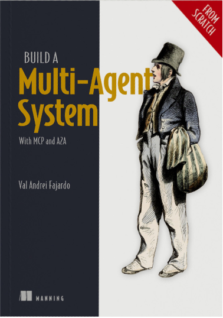
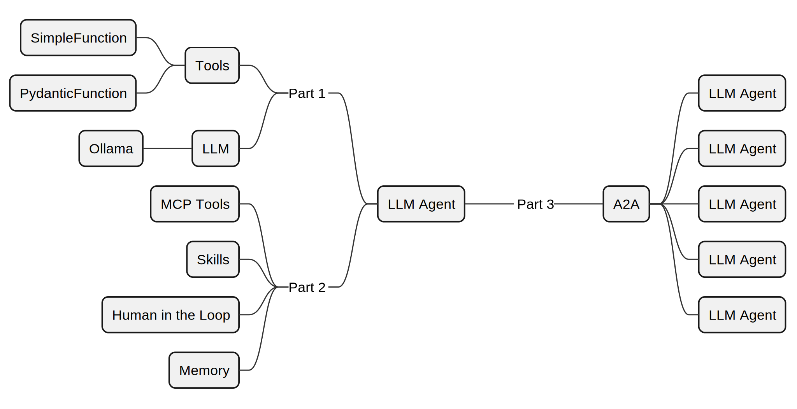
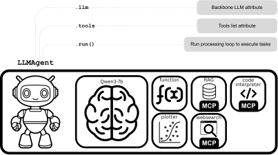

---
hide:
  - navigation
  - toc
---

<!-- markdownlint-disable-file MD041 MD033 MD042 -->

# Build a Multi-Agent System From Scratch

The companion library for *Build a Multi-Agent System — With MCP and A2A*
(Manning). Learn how LLM agents work by building one yourself, from first
principles, step by step.

Available now through Manning's Early Access Program (MEAP) — buy today and
get each chapter as it's completed.

[Buy the Book :octicons-book-24:](https://hubs.la/Q03Q0h7S0){ .md-button .md-button--primary }

## About the Book

Multi-agent systems and the LLM agents that power them are among the most
discussed topics in AI today. There are already many capable frameworks out
there — the goal of this book isn't to replace them, but to help you deeply
understand how they work by having you build one yourself, from scratch.

All the code lives in the book's own hand-rolled agent framework, primarily
designed for educational purposes rather than production deployment. It will
give you the foundation to work more confidently with any other LLM agent
framework of your choosing, or even to build your own specialised solutions.

The book's learning arc: build the foundations in Part 1, extend your agent in Part 2, and connect agents into a full MAS in Part 3.

### :material-numeric-1-circle: Build Your First LLM Agent

Start from scratch. Understand what LLM agents and MAS really are, build
tools with `SimpleFunction` and `PydanticFunction`, integrate a local Ollama
LLM, and assemble the full `LLMAgent` class.

### :material-numeric-2-circle: Enhance Your LLM Agent

Extend your agent with **MCP Tools**, composable **Skills**, short- and
long-term **Memory**, and **Human-in-the-Loop** patterns, with each chapter
adding a new capability on top of what you already built.

### :material-numeric-3-circle: Build Multi-Agent Systems

Connect multiple LLM agents into a collaborative MAS using the
**Agent2Agent (A2A)** protocol, distributing work across agents that
communicate, coordinate, and act together.

The <code>LLMAgent</code> you build through the book: a backbone LLM, a set of tools, and a single <code>.run()</code> method to kick it all off.

---

## From the Book

Each chapter builds on the last, progressively deepening your understanding
from core concepts to full multi-agent systems:

### Part 1 — Build Your First LLM Agent

| Ch | Title | Notebook |
| -- | ----- | -------- |
| 1 | What Are LLM Agents and Multi-Agent Systems? | — |
| 2 | Working with Tools | [Ch 2](notebooks/ch02.ipynb) |
| 3 | Working with LLMs | [Ch 3](notebooks/ch03.ipynb) |
| 4 | The LLM Agent Class | [Ch 4](notebooks/ch04.ipynb) |

### Part 2 — Enhance Your LLM Agent

| Ch | Title | Notebook |
| -- | ----- | -------- |
| 5 | MCP Tools | [Ch 5](notebooks/ch05.ipynb) |
| 6 | Skills | — |
| 7 | Memory | — |
| 8 | Human in the Loop | — |

### Part 3 — Building Multi-Agent Systems

| Ch | Title | Notebook |
| -- | ----- | -------- |
| 9 | Multi-Agent Systems with Agent2Agent | — |

---

## More Examples

A selection of additional worked examples showing the framework applied to real
integrations. Each explores a different use case you can adapt for your own
projects.

### :material-github: GitHub MCP

Walk through connecting the agent to the official GitHub MCP server. Discover
its available tools and run a simple query — a hands-on look at real-world MCP
integration.

[Open Notebook](more-examples/ch05/github_mcp.ipynb){ .md-button .md-button--primary }

### :material-newspaper-variant-outline: GoodNews MCP

Connect to the GoodNews MCP server to get good news delivered straight to your
LLM agent.

[Open Notebook](more-examples/ch05/goodnews_mcp.ipynb){ .md-button .md-button--primary }

[Browse all examples :octicons-arrow-right-24:](more-examples/ch05/github_mcp.ipynb){ .md-button }

---

## Capstone Projects

Capstones are larger, end-to-end projects that pull together what you have
built in the book and apply it to something closer to a real-world system.

### :material-pi: Monte Carlo Estimation of Pi

Orchestrate parallel tool calls to estimate π using the Monte Carlo method.
A great first capstone that exercises the full `LLMAgent` class.

[Open Notebook](capstones/one/capstone_1_ch05.ipynb){ .md-button .md-button--primary }

### :material-magnify: Deep Research Agent

*Coming soon.* An autonomous research agent that plans searches, synthesises
results, and produces structured reports on any topic you give it.

### :material-robot-outline: OpenClaw Personal Assistant

*Coming soon.* Build a personal assistant with persistent memory, skill
composition, and human-in-the-loop checkpoints using your own framework.

[Browse all capstones :octicons-arrow-right-24:](capstones/one/capstone_1_ch05.ipynb){ .md-button }

---

## Community

The framework is open source and built to be extended. Have you built a new
tool integration, a custom agent, or an interesting notebook? Share it with
other readers. A dedicated community showcase page is in the works.

[Share on GitHub Discussions :fontawesome-brands-github:](https://github.com/nerdai/llm-agents-from-scratch/discussions){ .md-button .md-button--primary }
